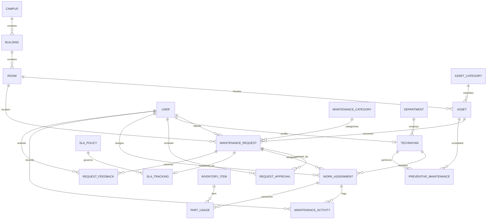

# CampusCare ER Diagram

```mermaid
erDiagram
 CAMPUS ||--o{ BUILDING : contains
 BUILDING ||--o{ ROOM : contains
 ROOM ||--o{ ASSET : houses
 ASSET_CATEGORY ||--o{ ASSET : classifies
 USER ||--o{ MAINTENANCE_REQUEST : reports
 ASSET ||--o{ MAINTENANCE_REQUEST : concerns
 ROOM ||--o{ MAINTENANCE_REQUEST : location
 MAINTENANCE_CATEGORY ||--o{ MAINTENANCE_REQUEST : categorizes
 DEPARTMENT ||--o{ TECHNICIAN : employs
 USER ||--o| TECHNICIAN : profile
 MAINTENANCE_REQUEST ||--o{ REQUEST_APPROVAL : reviewed_by
 USER ||--o{ REQUEST_APPROVAL : reviewer
 MAINTENANCE_REQUEST ||--o{ WORK_ASSIGNMENT : assigned
 TECHNICIAN ||--o{ WORK_ASSIGNMENT : receives
 USER ||--o{ WORK_ASSIGNMENT : assigns
 WORK_ASSIGNMENT ||--o{ MAINTENANCE_ACTIVITY : logs
 USER ||--o{ MAINTENANCE_ACTIVITY : records
 MAINTENANCE_REQUEST ||--o| SLA_TRACKING : monitored_by
 SLA_POLICY ||--o{ SLA_TRACKING : governs
 WORK_ASSIGNMENT ||--o{ PART_USAGE : consumes
 INVENTORY_ITEM ||--o{ PART_USAGE : item
 MAINTENANCE_REQUEST ||--o{ REQUEST_FEEDBACK : receives
 USER ||--o{ REQUEST_FEEDBACK : submits
 ASSET ||--o{ PREVENTIVE_MAINTENANCE : scheduled
 TECHNICIAN ||--o{ PREVENTIVE_MAINTENANCE : performs
```

The ERD represents the logical relationships implemented in `database/mysql/schema.sql`. Audit events are supplementary; the relational tables remain authoritative.
